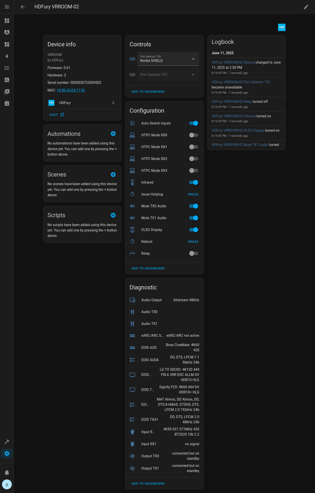
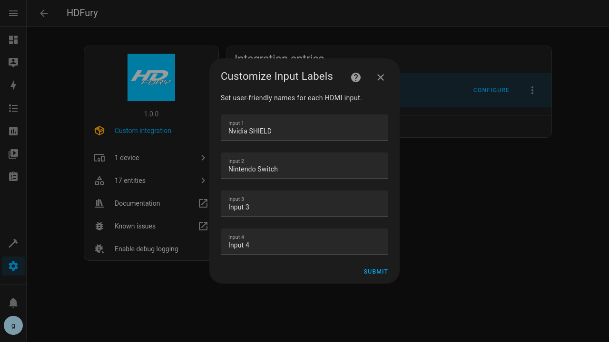

# HDFury Integration for Home Assistant

This custom integration allows Home Assistant to monitor and control compatible [HDFury](https://www.hdfury.com/) devices such as Diva, Vertex2, and VRROOM over the local network.

> ⚠️ **Deprecated**
> 
> This custom component has been superseded by the [HDFury core integration](https://home-assistant.io/integrations/hdfury) included in Home Assistant 2026.2+.  
> Please migrate to the [core integration](https://home-assistant.io/integrations/hdfury). [Follow the guide below](#migration-to-core)
> 
> ❤️ Thank you to everyone who used, tested, and contributed to this custom integration.
> The move to a [core integration](https://home-assistant.io/integrations/hdfury) ensures better stability, long-term support, and commitment to Home Assistant standards for all HDFury users.

## Migration to Core

As of Home Assistant 2026.2, HDFury is now available as a [core integration](https://home-assistant.io/integrations/hdfury).
This custom component is **deprecated** and will no longer receive updates or support.

**All users are strongly encouraged to migrate to the core integration by following the guide below:**

> ⚠️ Important:
> Due to internal changes between the custom integration and the core integration, **you must remove existing HDFury devices before removing the custom component**.
> Failing to do so may leave orphaned devices or entities in Home Assistant.

### Step 1: Remove HDFury Devices

1. Go to Settings → Devices & services
2. Locate your HDFury integration
3. Click the integration
4. Select each HDFury device
5. Click Delete Device

### Step 2: Remove the Custom Integration

#### If Installed via HACS

1. Go to **HACS**
2. Find **HDFury**
3. Click the three dots → **Remove**
4. Confirm removal

#### If Manually Installed

1. Remove the directory:
   ```text
   config/custom_components/hdfury
   ```
2. Ensure **no HDFury files remain** in `custom_components`

### Step 3: Restart Home Assistant

Perform a **full restart** (not just a reload):

**Settings → Click the three dots → Restart Home Assistant**

> This is required to avoid conflicts between the custom and core integration.

### Step 4: Add the Core HDFury Integration

Your HDFury device should be discovered automatically on the network.
If not follow these steps to add your devices:

1. Go to **Settings → Devices & services**
2. Click **Add Integration**
3. Search for **HDFury**
4. Follow the configuration flow:
   * Device IP or hostname

Once completed, your device should appear under **Devices**.

### Step 5: Verify Entities & Automations

The core integration aims to preserve entity naming, but **entity IDs may change** in some cases.
Update any:

* Automations
* Scripts
* Dashboards
* Templates

### What Happens If I Don’t Migrate?

* You may receive warnings or errors
* Future Home Assistant updates may **break the custom integration**
* No fixes or support will be provided for this repository

### Input Label Remapping (Removed)

The custom HDFury integration provided an option to remap input labels (e.g. Input 1, Input 2) to **custom user-defined names**.

This functionality is **not available** in the Home Assistant core integration.

#### Why Was This Removed?

Home Assistant core integrations follow strict design guidelines:

- Integrations should reflect the **actual state of the device**
- UI customization and user preferences should be handled via **helpers and automations**
- Device-specific options should not be used to implement UI-only behavior

Because input label remapping does not change the device state, but only affects how it is presented in Home Assistant, it was intentionally excluded from the core integration.

#### Recommended Alternative

To achieve the same result, we recommend using:

- A Select helper with your labels (input_select)
- One or more automations to map user-friendly labels to HDFury inputs
- Or utilize the blueprint available here: https://github.com/glenndehaan/homeassistant-hdfury/blob/master/blueprints/hdfury/input_mapping.yaml

---

## Features

* Setup via config flow (no YAML required)
* Select HDMI input ports via UI
* Customize input labels through the UI
* Reboot the HDFury device from Home Assistant
* Monitor device status (inputs, outputs, audio, EDID, eARC)
* Diagnostic information available in the entity state

## Supported Devices

Tested with the following HDFury devices:

* VRROOM
* Diva

## Installation

### HACS (Recommended)

[](https://my.home-assistant.io/redirect/hacs_repository/?owner=glenndehaan&repository=homeassistant-hdfury)

1. Ensure HACS is installed. If not, follow the [HACS installation guide](https://hacs.xyz/docs/use/download/download/).
2. Go to **HACS → Integrations**
3. Search for "HDFury" and install the integration.
4. Restart Home Assistant
5. Go to **Settings → Devices & Services** and add **HDFury**

### Manual

1. Clone this repository or download it as a ZIP.
2. Copy the `custom_components/hdfury` folder to your Home Assistant configuration at `/config/custom_components/hdfury`.
3. Restart Home Assistant.
4. Add HDFury via the UI (Settings → Devices & Services).

## Configuration

This integration uses a **UI config flow** — no YAML setup is needed.
Just enter the IP address of your HDFury device when prompted.

### Custom Input Labels

You can personalize the labels for HDMI inputs shown in Home Assistant.

To do this:
1. Go to **Settings → Devices & Services**
2. Click your **HDFury device**
3. Click the **Configure** button
4. Enter custom names for the HDMI inputs (e.g., "Apple TV", "PS5", etc.)

These labels will be reflected in the HDMI input select entity.

### Entity Overview

This integration will expose:

* **Sensors**: HDMI port state, audio output status, EDID info
* **Selects**: Input selection for HDMI TX ports (with custom labels)
* **Buttons**: Reboot device, Issue Hotplug
* **Switches**: Auto Switch Input, HTPC Modes, Audio Mutes, OLED Display, Infrared and Relay.

Each device is identified using its serial number and MAC address to ensure uniqueness across multiple HDFury units.

## Troubleshooting

* Ensure the HDFury device is on the same local network and its API is accessible.
* Validate access to `http://<device_ip>/ssi/infopage.ssi` from a browser.
* Enable debug logging for troubleshooting:

```yaml
logger:
  default: info
  logs:
    custom_components.hdfury: debug
```

## Contributions

Issues and pull requests are welcome. Please open an issue to report bugs or request features.

## Screenshots

### Device Overview



### Options



## License

MIT
